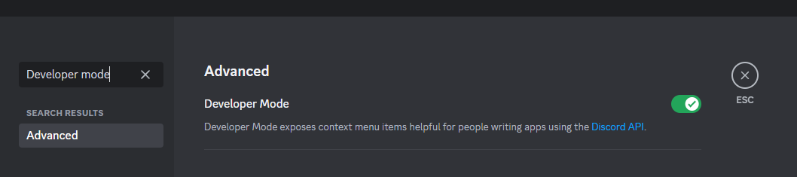

# Campaigns
Sprocket Bot's most complex features are its campaign tools.  Using the bot, you can create a fictional world with player-controlled factions that updates in real time.  Players can conduct transactions, manage their economies, and eventually much more.

Notable features:
- servers can host their own campaign, or join another one based on an access key
- players can join factions based on a server roles
- players can log transactions or maintenance costs between countries

## Warnings
Campaigns are by far the most complex feature of the bot, and as a result are likely to be buggy.  Features are likely to be added and experimented with throughout the campaign's development.

# ${\color{red}Read}$ ${\color{red}through}$ ${\color{red}the}$ ${\color{red}documentation}$ ${\color{orange}prior}$ ${\color{red}to}$ ${\color{red}starting}$ ${\color{red}a}$ ${\color{red}campaign!}$

## Definitions
- **IGY**: In Game Year
- **Discretionary funds**: the money that the player can use to buy and sell equipment, boost other parts of the faction, invest in research, etc.

# Setup
Ensure that a server administrator has ran the `-setup` command, so that a campaign manager role has been assigned.  You can check this with the `-viewServerConfig` command.

Make sure that Developer Mode is enabled in your Discord's user settings.  You will need this to copy channel IDs and role IDs.

Additionally, if you intend to start a campaign, you will need to acquire a campaign key.  This key is an anti-spam measure to prevent people from making campaigns en masse.  Join the [bot's development server](https://discord.gg/697ufH4hDa) and request a campaign key there.  Make sure to keep it logged somewhere.
## Campaign configuration

To set up a campaign, run the `-startCampaign` command and follow the instructions.  You'll be asked a various set of questions about the campaign.
- Campaigns are intended to have starting annual salaries for populations between 100 (approximately the poverty line) and 1000.  
- The amount of people that can live off a square kilometer of farmland will be affected by the campaign-set ratio, and the average latitude of the faction.

## Adding a faction

From here, run the `-addCampaignFaction` command.  Follow the instructions to add your faction to the campaign. Note that campaign managers from the host server will need to approve any factions that they don't upload themselves.

## Join another server's ongoing campaign
First, acquire the campaign key from the host.  Then, use the `-addServerToCampaign` bot command to join the campaign.

## Command list
### Management
- `-addServerToCampaign`: Allows campaign managers to link their server to another server's campaign.  Requires the registration key provided to the original server.
- `-joinFaction`: Allows the player to join a faction for a campaign.  The player must have the role that is specified in the faction's configuration.
- `-leaveCampaign`: Allows the player to leave all factions of a campaign.
- `-approveCampaignFactions`: Allows the campaign manager to approve factions into the campaign.  Any factions not submitted by a campaign manager must go through this process.
- `-overwriteCampaignSettings`: Allows campaign managers to change the settings of their campaign
### Information
- `-campaignSettings`: Allows players to see the settings for a campaign
- `-viewStats`: Allows players to view information about their faction
- `-addMoney`: Allows campaign managers to add or subtract money from a faction
- `-forceUpdate`: Forces the bot to update faction data
- `-toggleCampaignProgress`: Enables and disables forward progression of the campaign
### Finances
- `-viewFinances`: Allows countries to see more details regarding their finances
- `-setTaxes`: Allows for setting your country's rax rates.
- `-logPurchase`: Placeholder command.  Allows players to make a "purchase" from another faction.
- `-logMaintenance`: Placeholder command.  Allows players to pay for maintenance costs.

# Technical details 

## variables and constants for campaigns overall
timescale
- This variable determines how quickly the campaign's time moves compared to IRL time.  Ex: a timescale of 30 means that for every real-world day, 30 days will pass in the campaign.

currencyname
- The name of your currency.  This shows up in alot of financial commands.

currencysymbol
- The symbol for your currency.  This can be anything, but should be a unique symbol like $, %, &, etc.

defaultgdpgrowth
- The expected growth rate of a country's overall revenue.  Ex: a value of 0.06 will denote a 6% growth.

defaultpopgrowth
- The expected growth rate of a country's population every year.  

populationperkm
- THe expected value for how many people can live off an acre of farmland.  WIll be depreciated if no use can be found for this value.

taxestoplayer
- When a country collects taxes, not all of it can be spent by the player.  This ratio determines how much of those collected taxes go to the player.

poptoworkerratio
- The starting ratio of how many people to employed people are in a country.  AKA the average family size.  Bigger values should denote a happier populace, while smaller values should denote a more productive populace.

timedate
- the timestamp of the campaign, used to tell the time.

## Variables and constants for factions

Note: variables that have obvious details (such as the faction name) are ommitted here.

### Constants
(These are set by the user)

landsize
- The amount of land that a country controls
- This is a cosmetic value right now; it affects nothing.

governance
- This value is set when the player chooses their type of government, and can range between 0.8 and 1.2.  
- This value affects multiple other stats

taxpoor
- The tax rate set for the lower class.  This makes up the bulk of a faction's income, but has more drastic side effects if set too high.

taxrich
- The tax rate set for the upper class and corporations.  This affects the income tax levied on companies that reside within the faction.

educationspend
- A user-set value that determines how much discretionary funding is redirected to education
- Spending money in this category helps to increase new technology researched

socialspend
- A user-set value that determines how much discretionary funding is redirected to healthcare, social programs, etc.
- Spending money in this category provides an all-around improvement to various categories

infrastructurespend
- A user-set value that determines how much discretionary funding is redirected to improving transportation
- Increases in this value improve the efficiency of the army and overall GDP

### Variables
(Equations are used to keep these updated)

money
- The amount of discretionary funds available to the player.
- This value decreases as the player spends money, and increases automatically as taxes are collected.

population
- The amount of people spread out over the whole country

happiness
- The cumulative "index" that amalyzes other statistics to show the integrity of the country's society
- Low values will have negative downsides in the future

gdp
- The gross domestic product of a country over 1 IGY.  
- This value is meant to fluctuate in real time in response to other variables.

averagesalary
- The median salary of the population within a faction
- This value plays into GDP, and is expected to change in ways somewhat like the economic index.

incomeindex
- The financial stability "index" of the country
- This value is currently affected by just the tax rate, but in the future will be affected by other variables
- It is intended that this value can be adjusted to trigger random events in the future

lifeexpectancy
- The average life expectency within a country
- This value is meant to fluctuate over time as a result of medical spending, agriculture, and other factors.

educationindex
- How efficient the education is within a country
- This value is meant to change over time as a result of educational spending per pupil.

popworkerratio
- The country's population to worker ratio
- Used to help determine its tax revenue

