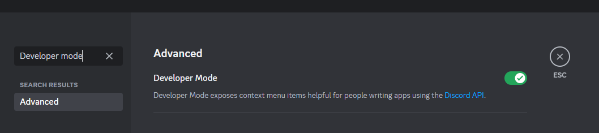

# Campaigns
Sprocket Bot's most complex features are its campaign tools.  Using the bot, you can create a fictional world with player-controlled factions that updates in real time.  Players can conduct transactions, manage their economies, and eventually much more.

Notable features:
- servers can host their own campaign, or join another one based on an access key
- players can join factions based on a server roles
- players can log transactions or maintenance costs between countries

## Warnings
Campaigns are by far the most complex feature of the bot, and as a result are likely to be buggy.  Features are likely to be added and experimented with throughout the campaign's development.

## Definitions
- **IGY**: In Game Year
- **Discretionary funds**: the money that the player can use to buy and sell equipment, boost other parts of the faction, invest in research, etc.

# Setup
Ensure that a server administrator has ran the `-setup` command, so that a campaign manager role has been assigned.  You can check this with the `-viewServerConfig` command.

Make sure that Developer Mode is enabled in your Discord's user settings.  You will need this to copy channel IDs and role IDs.

Additionally, you will need to acquire a campaign key.  This key is an anti-spam measure to prevent people from making campaigns en masse.  Join the [bot's development server](https://discord.gg/697ufH4hDa) and request a campaign key there.  Make sure to keep it logged somewhere.
## Campaign configuration
Start by preparing your [Campaign Setup](assets/CampaignSetupTemplate.json) json file.  In this file are several settings covering your overall campaign.  

- `Public announcement channel id`: This needs to be the channel ID of where you want the bot to send public announcements.  
    - To get a channel ID, right click on it and select "copy channel ID."  This will past a string of numbers into your clipboard similar to the example.

- `Manager logging channel id`: This needs to be the channel ID of where you want transaction logs to be sent.  Preferrably a channel only visible to campaign managers.

- `Default GDP growth`: This should indicate the default GDP growth per IGY.  A value of 0.01 indicates 1% growth.

- `Default population growth`: This should indicate the default population growth per IGY.  A value of 0.01 indicates 1% growth.

- `Population fed per farmland square km`: This indicates how many people can live off a square kilometer of farmland.  Real-world values average around 1000 to 2000.

- `Default ratio of taxes available to play`: When a country collect taxes, this ratio determines how much of those taxes become "discretionary funds" available to the player.

- `Population to worker ratio`: This ratio determines the average "family size," assuming only 1 family member is a worker.  This globally adjusts GDP for all countries, with bigger values lowering GDP.

Once this is complete, save the file, run the `-startCampaign` command, and follow the instructions.

## Adding a faction

In order to add a faction to the campaign, download the [faction configuration template](assets/FactionTemplate.json) json file. In this file are several settings pertaining to your specific faction.

- `Faction role ID`: This needs to define the role ID you intend to require before players can join the faction.

    - To get a role ID, open up your server profile and right-click on the role you intend to use.  Then select "copy role ID."  This will past a string of numbers into your clipboard similar to the given example.

- `Logging channel ID`: This needs to be a channel id of where you want faction updates to be sent to.

    - To get a channel ID, right click on it and select "copy channel ID."  This will past a string of numbers into your clipboard similar to the given example.

- `Flag image URL`: This needs to be a valid embeddable image.

- `Is a country`: Set to `true` to make the faction a country, otherwise set it to `false` to make it a company.

- `Military funds`: Set this to the player's starting discretionary funds.

From here, save the file and run the `-addCampaignFaction` command.  Follow the instructions to add your faction to the campaign. Note that campaign managers from the host server will need to approve any factions that they don't upload themselves.

## Join another server's ongoing campaign
First, acquire the campaign key from the host.  Then, use the `-addServerToCampaign` bot command to join the campaign.

## Command list
### Management
- `-addServerToCampaign`: Allows campaign managers to link their server to another server's campaign.  Requires the registration key provided to the original server.
- `-joinFaction`: Allows the player to join a faction for a campaign.  The player must have the role that is specified in the faction's configuration.
- `-leaveCampaign`: Allows the player to leave all factions of a campaign.
- `-approveCampaignFactions`: Allows the campaign manager to approve factions into the campaign.  Any factions not submitted by a campaign manager must go through this process.
- `-overwriteCampaignSettings`: Allows campaign managers to change the settings of their campaign
### Information
- `-campaignSettings`: Allows players to see the settings for a campaign
- `-viewStats`: Allows players to view information about their faction
- `-addMoney`: Allows campaign managers to add or subtract money from a faction
- `-forceUpdate`: Forces the bot to update faction data
- `-toggleCampaignProgress`: Enables and disables forward progression of the campaign
### Finances
- `-viewFinances`: Allows countries to see more details regarding their finances
- `-setTaxes`: Allows for setting your country's rax rates.
- `-logPurchase`: Placeholder command.  Allows players to make a "purchase" from another faction.
- `-logMaintenance`: Placeholder command.  Allows players to pay for maintenance costs.

